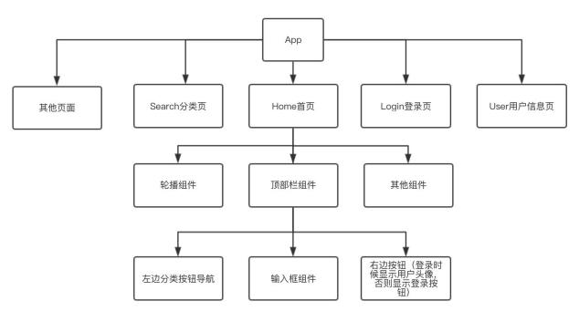
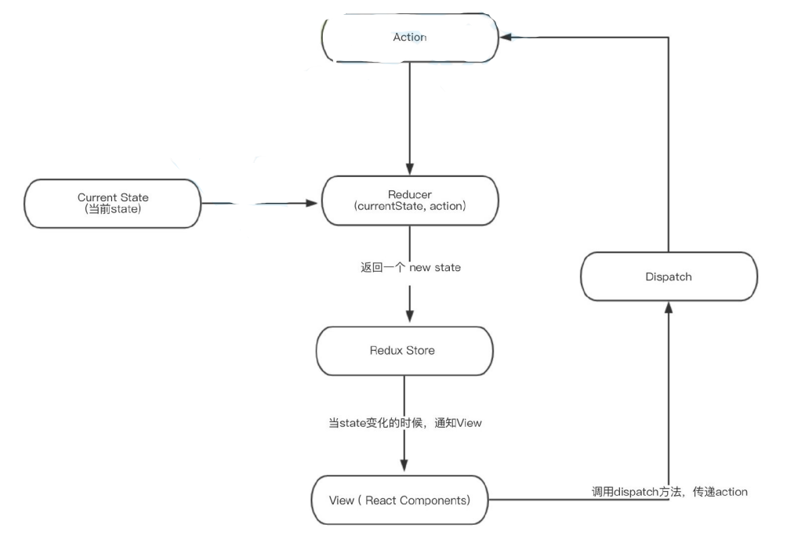

### Redux

##### 你可能不需要redux

Redux 是负责组织 state 的⼯具，但你也要考虑它是否适合你的情况。不要因为有⼈告诉你要⽤Redux

就去⽤，花点时间好好想想使⽤了 Redux 会带来的好处或坏处。

在下⾯的场景中，引⼊ Redux 是⽐较明智的：

-   你有着相当⼤量的、随时间变化的数据；

-   你的 state 需要有⼀个单⼀可靠数据来源；

-   你觉得把所有 state 放在最顶层组件中已经⽆法满⾜需要了。

-   某个组件的状态需要共享。



##### redux 

redux 是 JavaScript应⽤的状态容器，提供可预测化的状态管理。它保证程序⾏为⼀致性且易于测试。



##### redux上⼿

⽤⼀个累加器举例

1.   需要⼀个store来存储数据 
2.   store⾥的reducer初始化state并定义state修改规则 
3.    通过dispatch⼀个action来提交对数据的修改 
4.   action提交到reducer函数⾥，根据传⼊的action的type，返回新的state

```js
// 创建store，src/store/ReduxStore.js

import { createStore } from "redux";

function counterReducer(state = 0, action) {
  switch (action.type) {
    case "ADD":
      return state+=1;
    case "MINUS":
      return state-=1;
    default:
      return state;
  }
}

const store = createStore(counterReducer);

export default store;
```


```jsx
// 创建ReduxPage

import React, { Component } from "react";
import store from "../store/ReduxStore";

export default class ReduxPage extends Component {
  componentDidMount() {
    store.subscribe(() => {
      // this.forceUpdate()
      this.setState({})
    });
  }
  add = () => {
    store.dispatch({ type: "ADD" });
  };
  minus = () => {
    store.dispatch({ type: "MINUS" });
  };
  render() {
    return (
      <div>
        <h3>ReduxPage</h3>
        <p>{store.getState()}</p>
        <button onClick={this.add}>ADD</button>
        <button onClick={this.minus}>MINUS</button>
      </div>
    );
  }
}

```

##### 检查点 

1. createStore 创建store 
1. reducer 初始化、修改状态函数 
1. getState 获取状态值
1.  dispatch 提交更新 
1. subscribe 变更订阅


### React-redux

react-redux提供了两个api

1.   Provider 为后代组件提供store

2.   connect 为组件提供数据和变更⽅法

全局提供store，index.js

```jsx
import React from 'react'
import ReactDom from 'react-dom'
import App from './App'
import store from './store/'
import { Provider } from 'react-redux'
ReactDom.render(
 <Provider store={store}>
 	<App/>
 </Provider>,
 document.querySelector('#root')
)
```


```jsx
// 获取状态数据，ReactReduxPage.js

```


